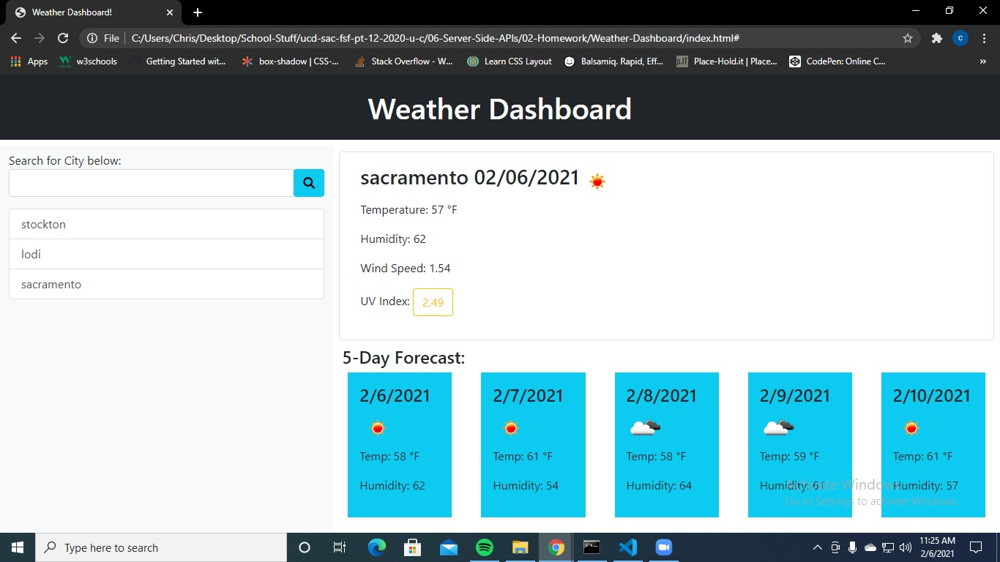

# 06 Server-Side APIs: Weather Dashboard

## User Story

```
AS A traveler
I WANT to see the weather outlook for multiple cities
SO THAT I can plan a trip accordingly
```

## Functionality

```
User can input a city name and click the search button represented by binoculars. 
Will display the current days forecast and the next 5 days forecast for whatever city was searched. 
Previously searched cities are save in a search history list under the search bar.
```

## Repo URL and live site URL
https://github.com/toasted-coder/Weather-Dashboard  - Repo URL <br>
https://toasted-coder.github.io/Weather-Dashboard/  - Live site URL<br>


## Screenshot

